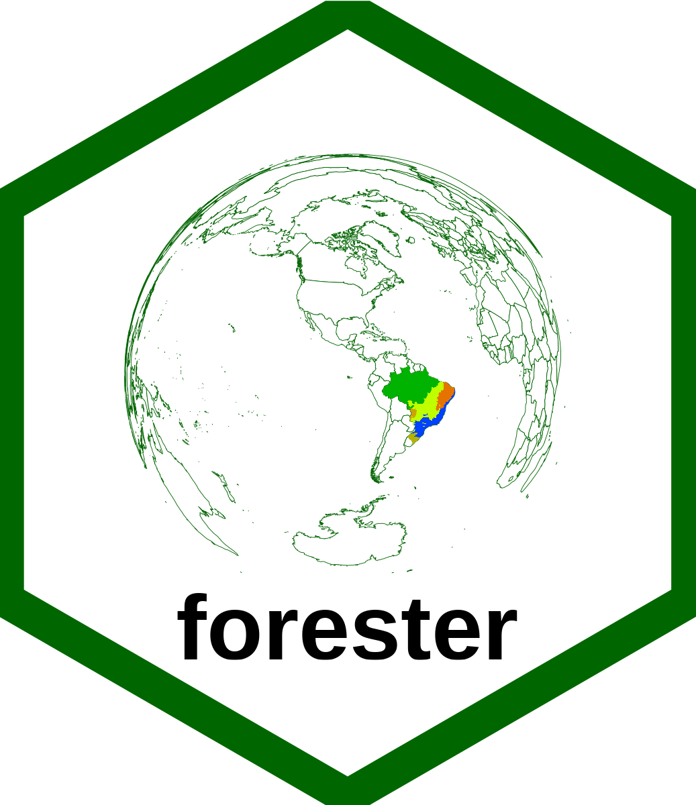

<!-- README.md is generated from README.Rmd. Please edit that file -->

```{r, include = FALSE}
knitr::opts_chunk$set(
  collapse = TRUE,
  comment = "#>",
  fig.path = "man/figures/README-",
  out.width = "100%",
  echo = TRUE
)
```

# Hello, welcome! :smiley: :grin:

# forester (under development)

<a href='https://tidyverse.tidyverse.org'></a>

<!-- badges: start -->
<!-- badges: end -->

The `forester` package constitutes a set of functions with mathematical and statistical methods traditionally used by forestry engineers to analyze forest inventory data.

## Installation

You can install the released version of `forester` from [CRAN](https://CRAN.R-project.org) with:

``` r
install.packages("forester")
```

And the development version from [GitHub](https://github.com/) with:

``` r
# install.packages("devtools")
devtools::install_github("DeivisonSouza/forester")
```
## Simple Random Sampling

A basic example of applying the RS function to obtain simple random sampling estimates (Sanquetta et al., 2014, page: 110-113):

```{r ex1}
library(forester)
data("pinus")
RS(x = pinus$Volume, A = 40, a = 0.06, LE = 0.1, FP = F)
```

An example using factor:

```{r ex2}
data("species2")
RS(x = species2$Volume, by = species2$Specie, A = c(40, 50, 60, 70), a = c(0.06, 0.07, 0.05, 0.08), FP = F, DT = F)
```

## Stratified Random Sampling

This is a basic example which shows you how to solve a common problem (Sanquetta et al., 2014, page: 122-129):

```{r ex3}
data("native")
SRS(x=native$Volume1, strata=native$Strata, A = c(650, 350), a = 1, LE = 0.1, SA = "PA", FP = FALSE, DT = FALSE, digits = 3)
```

## Reference

SANQUETTA, C. R.; CORTE, A. P. D.; RODRIGUES, A. L.; WATZLAWICK, L. F. Inventário Florestal: Planejamento e execução. 3. ed. Curitiba: Multi-Graphic Gráfica e Editora., 2014. 406p.
